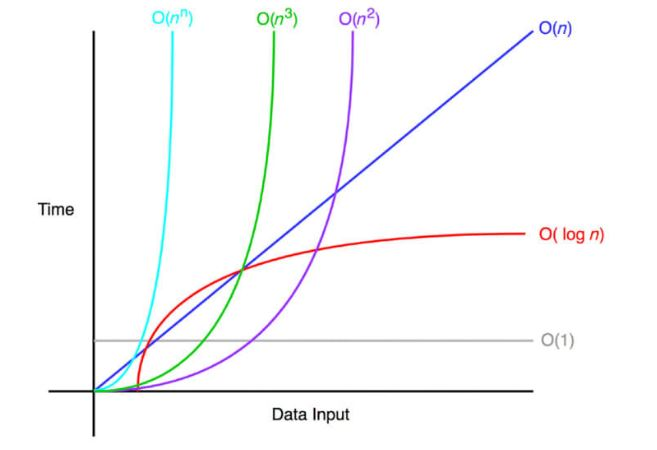

# C#

## Índice
1. [Estruturas de dados](#estruturas-de-dados)
    1. [Collections](#collections)

## Estruturas de dados

### Collections
Usada para armazenar dados similares.

- Generic Collections: Tipadas. Geralmente mais performáticas.
- Non-generic Collections: Armazena itens como um `Object`. É necessário realizar `casting`.

#### Operações

- Add
- Remove
- Find

#### Interface

`ICollection<T>` é a interface comum. Ela contém

- Habilidade de enumerar
- Habilidade de copiar o conteúdo da collection em um array
- Propriedades de `Capacity` e `Count`: Capacidade é quanto pode ter e Count é quanto realmente tem. A maior parte das estruturas aloca memória dinamicamente, mas isso pode ter um custo. Dessa forma, é aconselhável especificar o tamanho.

Comparação entre `Fixed` e `Dynamic`:

| Method  | Capacity | Mean             | Error            | StdDev           | Median           |
|-------- |--------- |-----------------:|-----------------:|-----------------:|-----------------:|
| Fixed   | 10       |         27.99 ns |         1.222 ns |         3.605 ns |         28.29 ns |
| Dynamic | 10       |         60.23 ns |         3.169 ns |         9.294 ns |         60.30 ns |
| Fixed   | 1000     |      2,182.55 ns |        94.779 ns |       276.476 ns |      2,209.87 ns |
| Dynamic | 1000     |      2,232.04 ns |        83.148 ns |       241.229 ns |      2,113.25 ns |
| Fixed   | 100000   |    348,644.57 ns |    12,966.641 ns |    38,232.436 ns |    359,371.51 ns |
| Dynamic | 100000   |    516,702.92 ns |    18,736.023 ns |    53,757.166 ns |    530,128.03 ns |
| Fixed   | 1000000  |  3,503,443.20 ns |   163,623.331 ns |   477,296.971 ns |  3,521,617.19 ns |
| Dynamic | 1000000  |  5,436,108.59 ns |   236,776.378 ns |   698,140.542 ns |  5,491,756.64 ns |
| Fixed   | 10000000 | 21,155,728.75 ns |   421,055.518 ns |   393,855.593 ns | 21,077,031.25 ns |
| Dynamic | 10000000 | 50,907,475.48 ns | 1,112,447.278 ns | 3,262,615.532 ns | 51,692,236.36 ns |

Comparação entre `Fixed`, `Dynamic` e `Yield`

| Method  | Capacity | Mean         | Error       | StdDev     |
|-------- |--------- |-------------:|------------:|-----------:|
| Fixed   | 10       |    36.255 ns |   2.4044 ns |   7.052 ns |
| Dynamic | 10       |    68.326 ns |   3.3755 ns |   9.900 ns |
| Yield   | 10       |     7.570 ns |   0.5439 ns |   1.561 ns |
| Fixed   | 100      |   232.983 ns |  10.7595 ns |  30.347 ns |
| Dynamic | 100      |   422.533 ns |  20.8066 ns |  61.022 ns |
| Yield   | 100      |     8.769 ns |   0.4522 ns |   1.297 ns |
| Fixed   | 1000     | 2,844.012 ns | 100.3008 ns | 286.164 ns |
| Dynamic | 1000     | 4,048.657 ns | 235.1083 ns | 685.822 ns |
| Yield   | 1000     |     8.817 ns |   0.7861 ns |   2.256 ns |

- Item inicial (`lower bound`)
- Sincronização para acesso multi threads

#### Escolha

Complexidade:

| Gostaria de                                                 | Generic                    | Immutable                                                                                         |
| ----------------------------------------------------------- | -------------------------- | ------------------------------------------------------------------------------------------------- |
| Armazenar chave/valor  para busca rápida por  chave   | Dictionary<TKey, TValue>   | ConcurrentDictionary<Tkey,TValue> ReadOnlyDictionary<TKey,TValue> Immutable<TKey,TValue>    |
| Acessar itens por indíce                                    | List<T>                    | ImmutableList<T>                                                                                  | 
| FIFO                                                        | Queue<T>                   | ConcurrentQueue<T> ImmutableQueue<T>                                                           |
| LIFO                                                        | Stack<T>                   | ConcurrentStack<T> ImmutableStack<T>                                                           |
| Acessar itens sequenciais                                   | LinkedList<T>              |                                                                                                   |
| Receber notificação ao remover/add                          | ObservavleCollection<T>    |                                                                                                   |
| Lista ordenada                                              | SortedList<TKey,TValue>    | ImmutableSortedDictionary<TKey,Value> ImmutableSortedSet<T>                                    |     
| Conjunto de funções matemáticas                             | HashSet<T> SortedSet<T> | ImmutableHashSet<T> ImmutableSortedSet<T>                                                      |
#### Referências

[Collections](https://learn.microsoft.com/en-us/dotnet/standard/collections/)

