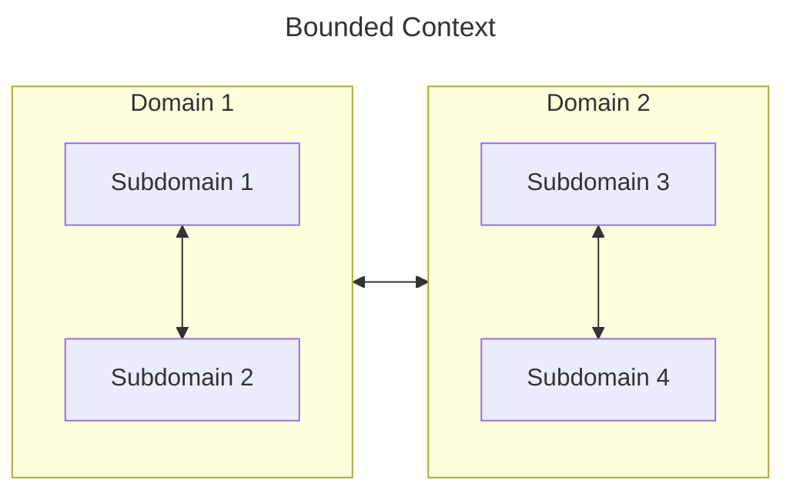

# Building Event-Driven Microservices

## Índice
1. [Capítulo 1](#capítulo-1)
    1. [DDD](#ddd)
        1. [Microserviços](#microserviços)
    1. [Estruturas de comunicação](#estruturas-de-comunicação)
        1. [Lei de Conway](#lei-de-conway)
        1. [Comunicação tradicional](#comunicação-tradicional)
        1. [Estrutura de comunicação guiada à evento](#estrutura-de-comunicação-guiada-à-evento)
        1. [Microserviços sync](#microserviços-sync)
1. [Capítulo 2](#capítulo-2)
1. [Referências](#referências)

## Capítulo 1

### DDD

- Domain
- Subdomain
- Domain/Subdomain model
- Bounded Context
    - Conexões dentro do limite devem ser muito coesas. 
    - Conexões fora do limite devem evitar propagar mudanças

#### Microserviços

A ideia é partir dos domínios macros da companhia e ir criando subdomínios até que estejam granulares o suficientes para serem desenvolvidos por um time. 

Essa é a base para os microserviços.

O serviço deve estar alinhado com as necessidades de negócio e não a necessidades de tecnologia.

O maior problema de alinhar a tecnologia é que um fluxo de negócio irá cruzar muitos limites de domínio.

### Estruturas de comunicação

- Estrutura de comunicação de negócio
- Estrutura de comunicação de implementação
- Estrutura de comunicação de dados

#### Lei de Conway
"Organizations which design systems... are constrained to produce designs which are copies of the communication structures of these organizations". April 1968.

Estruturas de comunicação ruins não permitem criar sistemas novos com lógicas separadas e fornecem uma forma fácil de acessar os dados existentes de maneira que o sistema não evolua.

#### Comunicação tradicional

Uma nova funcionalidade dentro de um domínio, pode:

- Gerar um novo serviço
    - Sincronização de dados
- Ser adicionada em um serviço existente
    - Monolito

Separação de um monolito:
- Qual time é dono de qual dado?
- Onde o dado é persistido?
- E quando o dado precisa ser modificado por ambos os times?

#### Estrutura de comunicação guiada à evento

- Eventos são bases da comunicação
- Eventos fornecem uma única fonte de verdade

Benefícios:
- Granularidade
- Escalabilidade
- Flexibilidade tecnológica
- Flexibilidade de requisitos de negócio
- Baixo acoplamento
- Suporte para entrega contínua
- Alta testabilidade

#### Microserviços sync

Contras:
- Acoplamento point to point
- Escala dependente
- Tratamento de falha de serviço
- Versionamento de APIs e gestão de dependência
- Acesso a dados amarrado a implementação
- Monolito distribuído 
- Testes

## Capítulo 2

# Referências

[Building Event-Driven Microservices: Leveraging Organizational Data at Scale 1st Edition](https://www.amazon.com/Building-Event-Driven-Microservices-Leveraging-Organizational/dp/1492057894)

<!--

 -->
