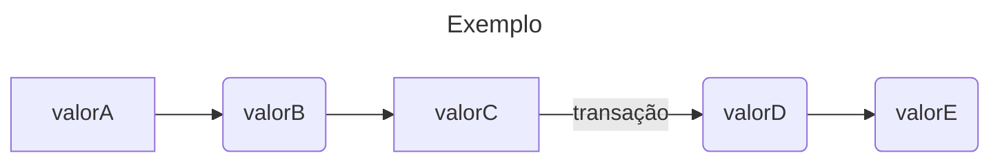

# Building Event-Driven Microservices

# Referência

[Building Event-Driven Microservices: Leveraging Organizational Data at Scale 1st Edition](https://www.amazon.com/Building-Event-Driven-Microservices-Leveraging-Organizational/dp/1492057894)

<!--

 -->