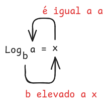
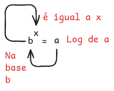
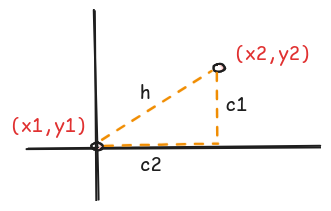

# Base binária

Representada por 1 e 0. Exemplo: 11001 na base binária equivale a 25 na decimal.

### Transformar binário em decimal

#### 11001:

- 1 x (2 ^ 4) = 16
- 1 x (2 ^ 3) = 8
- 0 x (2 ^ 2) = 0
- 0 x (2 ^ 1) = 0
- 1 x (2 ^ 0) = 1

16 + 8 + 0 + 0 + 1 = 25

Em resumo: Varremos dígito por dígito elevado a posição que ocupa do algorismo completo (de 0 a n da direita para a esquerda)

#### 10:

- 1 x (2 ^ 1) = 2
- 0 x (2 ^ 0) = 0

2 + 0 = 2

### Transformar decimal em binário

#### 2
- Etapa 1: Dividimos por 2
    - 2 / 2 = 1
    - 2 % 2 = 0

Se o quociente da divisão for menor do que 2, paramos as divisões nele e coletamos o quociente concatenado com o resto: 10.

#### 25

- Etapa 1: Dividimos por 2
    - 25 / 2 = 12
    - 25% % 2 = 1

Guardamos o resto 1 em uma pilha (LIFO)

- Etapa 2: Dividimos por 2 o quociente da última divisão
    - 12 / 2 = 6
    - 12 % 2 = 0
    - Guardamos o resto 0 em uma pilha

- Etapa 3: Dividimos por 2 o quociente da última divisão
    - 6 / 2 = 3
    - 6 % 2 = 0
    - Guardamos o resto 0 em uma pilha

- Etapa 4: Dividimos por 2 o quociente da última divisão
    - 3 / 2 = 1
    - 3 % 2 = 1
    - Como o quociente da divisão é menor do 2, paramos aqui e armazenamos os valores resto e quociente (deve ser o último valor da pilha) numa pilha.

- Resultado da pilha:
1
1
0
0
1

Logo, o valor 25 na base decimal equivale ao valor 11001 na base binária.

# Logaritmo

$log{_b}{a}$ = x <=> bx = a

- b = base
- a = número desejado
- x = o log de `a` na base `b`

# Conjunto

Uma coleção de itens distintos que a ordem não importa

# Permutação

Um subconjunto de um conjunto em que a ordem importa

Exemplo: (a,b,c)

Podemos ter 3 x 2 x 1 combinações em que a ordem importa. Ou seja, 3!

## Parcial

P(n,r) = n! / (n - r)!

Exemplo: Quantas formas de escolher 2 pessoas de um grupo de 4 para uma dupla com ordem?

P(4,2) = 4! / (4 - 2)! = 24/2 = 12

# Combinação

Escolher N elementos sem se importar com a ordem

C(n,r) = n! / (r! x (n - r)!)

# Subconjunto

Um subconjunto é um conjunto de elementos que pertence a outro conjunto. Pode ser vazio ou igual ao conjunto. 

Calcular combinações: $\sum_{k=1}^n$  2n = total

# Soma aritmética

sum(1,3,5,7) = (1 + (2 x 0)) + (1 + (2 x 1)) + (1 + (2 x 2)) + (1 + (2 x 3))
sum(a,..,n) = (a + (r x 0)) + (a + (r x 1)) + (a + (r x 2)) + ... + (a + (r x (n -1)))

((a + n) * q)/2

# Soma geométrica

sum(1,2,4,8):
- a = 1
- r = 2
- q = 4

sum(1,2,4,8) = (a * (1 - (r ^ q)))/(1 - r) = (1 * (1 - (2 ^ 4)))/(1 - 2) = 15

# Primo

Número que pode ser dividido de maneira exata por ele mesmo e por 1.

É suficiente validar: 1 ... $\sqrt{n}$ para avaliar se N é primo.

# Heap

Detalhes nesse [link](README_heap.md)

# Distância entre dois pontos

- p1 = (x1,y1)
- p2 = (x2,y2)

Teorema de pitágoras:

h2 = c12 + c22

c1 = y2 - y1 
c2 = x2 - x1 

h2 = (y2 - y1)2 + (x2 - x1)2

$\sqrt{h^2}$ = $\sqrt{(y2 - y1)^2 + (x2 - x1)^2}$

h = $\sqrt{(y2 - y1)^2 + (x2 - x1)^2}$

Podemos armazenar os valores numa heap e obter os `k closest points`.

# Merge entre listas ordernadas

Detalhes nesse [link](README_merge_list.md)

