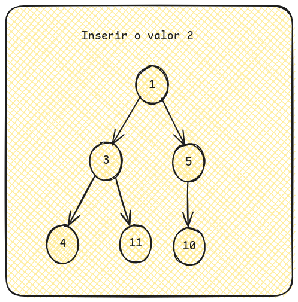
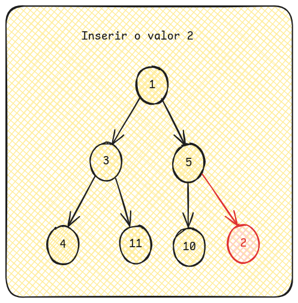
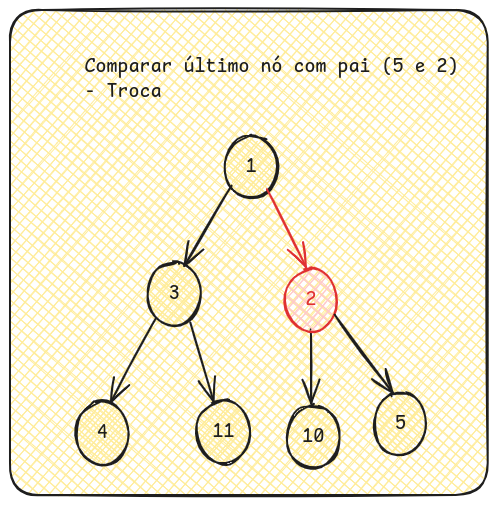
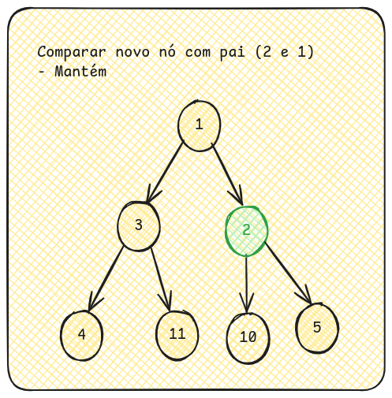
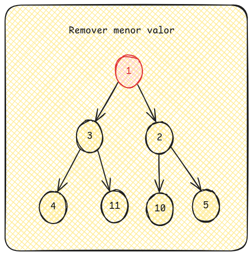
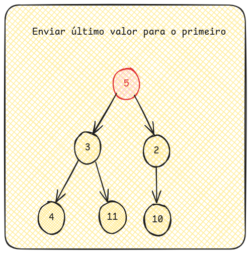
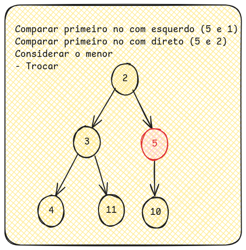
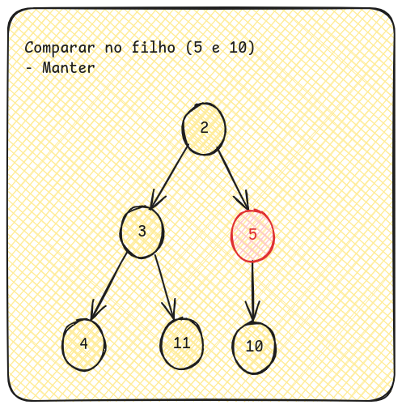
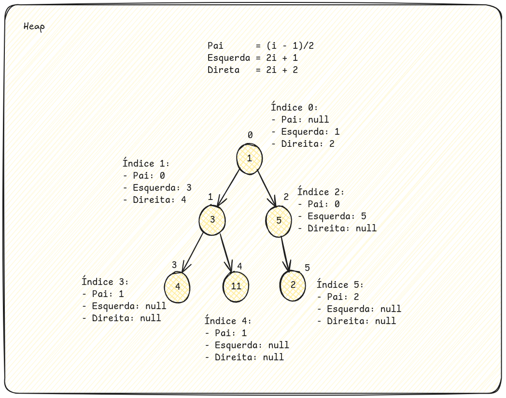

# Índice
1. [BinaryHeap](#binary-heap)
    1. [Representação em C#](#representação-em-c)
    1. [Inserção](#inserção)
    1. [Remoção](#remoção)
    1. [Swap](#swap)
    1. [Pai e filhos](#pai-e-filhos)
    1. [Código de exemplo](#código-de-exemplo)
        1. [Código](#código)
        1. [Tests](#testes)

# Binary Heap

A binary heap é uma estrutura de árvore completa armazenada em um vetor de maneira que cada nó `i`:
- Se não for raiz, vai ter um pai `(i - 1)/2`
- Pode ter um filho esquerdo `2i + 1`
- Pode ter um filho direito `2i + 2`
- O valor de cada filho deve ser maior do que o pai. Raiz é o menor valor da árvore (MinHeap)

## Representação em c#
```c#
public record HeapItem<T>(T Item, int Distancia);

public class Heap<T>{
    public List<HeapItem<T>> heap = [];

    public Heap() { }

    public Heap(List<HeapItem<T>> heap) => heap.ForEach(Inserir);

    public void Inserir(HeapItem<T> item){
        heap.Add(item);
        var ultimoIndice = heap.Count - 1;
        BubbleUp(ultimoIndice);
    }

    public HeapItem<T>? Remover(){
        if(heap.Count == 0)
            return null;
        var minValue = heap[0];
        var ultimoIndice = heap.Count - 1;
        heap[0] = heap[ultimoIndice];
        heap.RemoveAt(ultimoIndice);

        BubbleDown(0);
        return minValue;
    }

    public void BubbleUp(int indice){
        if(indice < 1)
            return;

        var novoItem = heap[indice];

        var indicePai = ObterPai(indice);

        var pai = heap[indicePai];

        if(novoItem.Distancia < pai.Distancia){
            Swap(indice, indicePai);
            BubbleUp(indicePai);
        }
    }

    public void BubbleDown(int indice){
        if(heap.Count == 0)
            return;
        var menorValor = heap[indice];
        var indiceComMenorValor = indice;

        var indiceFilhoEsquerdo = ObterFilhoEsquerdo(indice);
        if(indiceFilhoEsquerdo > -1 && menorValor.Distancia > heap[indiceFilhoEsquerdo].Distancia){
            menorValor = heap[indiceFilhoEsquerdo];
            indiceComMenorValor = indiceFilhoEsquerdo;
        }
        var indiceFilhoDireito = ObterFilhoDireito(indice);
        if(indiceFilhoDireito > -1 && menorValor.Distancia > heap[indiceFilhoDireito].Distancia){
            menorValor = heap[indiceFilhoDireito];
            indiceComMenorValor = indiceFilhoDireito;
        }

        if(indiceComMenorValor != indice){
            Swap(indiceComMenorValor, indice);
            BubbleDown(indiceComMenorValor);
        }
    }

    public void Swap(int indice, int pai){
        var temp = heap[indice];
        heap[indice] = heap[pai];
        heap[pai] = temp;
    }

    public int ObterPai(int indice){
        int pai = (indice - 1) / 2;
       
        return indice >= 1 ? pai : -1;
    }

    public int ObterFilhoEsquerdo(int indice){
        var filho = (2 * indice) + 1;

        return filho < heap.Count - 1 ? filho : -1;
    }

    public int ObterFilhoDireito(int indice){
        var filho = (2 * indice) + 2;

        return filho < heap.Count ? filho : -1;
    }
}
```
OBS: Peço desculpas pela mistura pt/en, mas swap e bubbleUp são termos comuns na implementação.

### Inserção

Dada a heap `[1,3,5,4,11,10]`. Visualmente na estrutura de árvore:

[]

Ao inserir o valor `2`, devemos adicionar no fim do vetor.
`[1,3,5,4,11,10,2]`.

```c#
public void Inserir(HeapItem<T> item){
    heap.Add(item);
    ...
}
```
Visualmente na estrutura de árvore:




Podemos ver que a árvore está desbalanceada: `5` é maior do que `2`, mas está como pai de `2`.

Nessa etapa, devemos aplicar o método `BubbleUp` para dado um índice ir comparando com os pais e, se necessário, realizar a troca para balancear a árvore.

```c#
public void Inserir(HeapItem<T> item){
    heap.Add(item);
    var ultimoIndice = heap.Count - 1;
    BubbleUp(ultimoIndice);
}

public void BubbleUp(int indice){
    if(indice < 1)
        return;

    var novoItem = heap[indice];

    var indicePai = ObterPai(indice);

    var pai = heap[indicePai];

    if(novoItem.Distancia < pai.Distancia){
        Swap(indice, indicePai);
        BubbleUp(indicePai);
    }
}
```

Na primeira chamada ao `BubbleUp`, trocamos o `2` e `5`.



Na segunda chamada ao `BubbleUp`, usamos a posição do `2` que agora é pai do `5`.
Como `1` é menor do que`2`, finalizamos o algoritmo.




### Remoção

Dada a heap `[1,3,5,4,11,10,5]`. Visualmente na estrutura de árvore:

[]

Ao remover o menor valor `1`, devemos:
- Armazenar menor valor
- Pegar último valor do vetor e adicionar na raiz
- Remover último valor do vetor
- Balancear a árvore

```c#
public HeapItem<T>? Remover(){
    if(heap.Count == 0)
        return null;
    var minValue = heap[0];
    var ultimoIndice = heap.Count - 1;
    heap[0] = heap[ultimoIndice];
    heap.RemoveAt(ultimoIndice);

    BubbleDown(0);
    return minValue;
}
```

[]

Devemos comparar à partir da raiz cada filho para encontrar o menor valor e, se necessário, trocar o valor para manter o menor valor no topo.


```c#
public void BubbleDown(int indice){
    if(heap.Count == 0)
        return;
    var menorValor = heap[indice];
    var indiceComMenorValor = indice;

    var indiceFilhoEsquerdo = ObterFilhoEsquerdo(indice);
    if(indiceFilhoEsquerdo > -1 && menorValor.Distancia > heap[indiceFilhoEsquerdo].Distancia){
        menorValor = heap[indiceFilhoEsquerdo];
        indiceComMenorValor = indiceFilhoEsquerdo;
    }
    var indiceFilhoDireito = ObterFilhoDireito(indice);
    if(indiceFilhoDireito > -1 && menorValor.Distancia > heap[indiceFilhoDireito].Distancia){
        menorValor = heap[indiceFilhoDireito];
        indiceComMenorValor = indiceFilhoDireito;
    }

    if(indiceComMenorValor != indice){
        Swap(indiceComMenorValor, indice);
        BubbleDown(indiceComMenorValor);
    }
}
```

[]

Repetimos esse processo até que o pai não seja maior do que filhos

[]


### Swap

O algotimo `swap` basicamente troca de posição dois índices de um vetor.


### Pai e filhos

```c#
public int ObterPai(int indice){
    int pai = (indice - 1) / 2;
    
    return indice >= 1 ? pai : -1;
}

public int ObterFilhoEsquerdo(int indice){
    var filho = (2 * indice) + 1;

    return filho < heap.Count - 1 ? filho : -1;
}

public int ObterFilhoDireito(int indice){
    var filho = (2 * indice) + 2;

    return filho < heap.Count ? filho : -1;
}
```



### Código de exemplo

#### Código
Código disponível em [Binary Heap](https://github.com/willsbctm/estudos/blob/main/Exemplos/Implementacoes/Heap.cs).

#### Testes
Testes disponíveis em [Testes](https://github.com/willsbctm/estudos/blob/main/Exemplos/Implementacoes.Tests/HeapTests.cs).

Atualmente o C# conta com a a estrutra [PriorityQueue<TElement,TPriority>](https://learn.microsoft.com/en-us/dotnet/api/system.collections.generic.priorityqueue-2?view=net-9.0) que implementa o comportamento da heap.
