# Índice
1. [Merge entre listas Ordenadas](#merge-entre-listas-ordenadas)
    1. [Uso da heap](#uso-da-heap)

# Merge entre listas ordenadas

Dada as listas ordenadas:
- [1,3,5]
- [2,4,6]
- [7,10]

Devemos unificá-las e manter a ordenação.

O resultado esperado é: `[1,2,3,4,5,6,7,10]`.

Estratégias de resolução:

1. Concatenar as 3 listas e ordernar. Complexidade de ordenação é O(n (log(n))).
2. Inserir todos os registros em uma heap e tirar um a um. Complexidade de inserção e remoção para O(log(n)). Para N elementos é O(n log(n)).
3. Inserir k elementos em uma heap onde k é o número de listas. Complexidade O(n log(k)).

Se k < n, a estratégia 3 é vantajosa.

## Uso da heap

Pegar primeiro valor de cada lista e inserir na heap: `[1,2,7]`

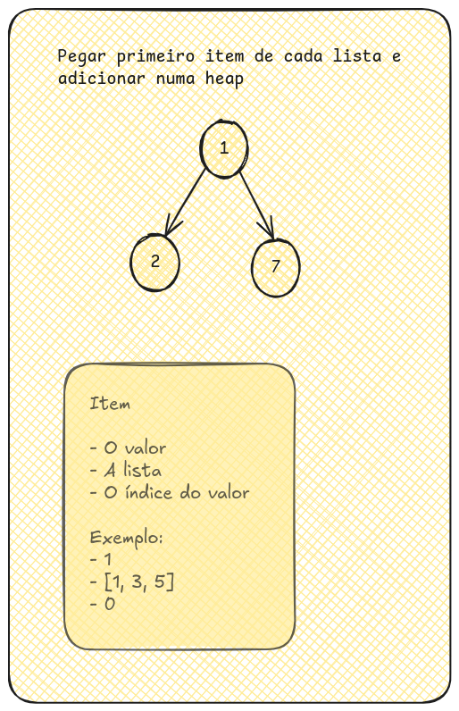

No valor de cada item, devemos ter:
- O valor
- A lista
- O índice do valor

Teremos:
- 1
    - Valor: 1
    - Lista: [1,3,5]
    - Índice: 0
- 2
    - Valor: 2
    - Lista: [2,4,6]
    - Índice: 0

- 7
    - Valor: 7
    - Lista: [7,10]
    - Índice: 0

Devemos criar uma nova lista e remover o primeiro item da heap: `[1]`

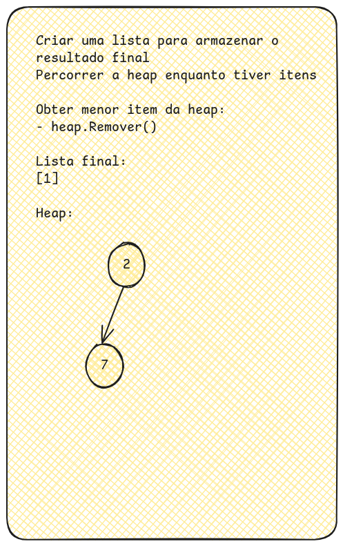

Devemos incrementar o item na respectiva lista. como o 1 foi removido e está na primeira lista [1,3,5], o item que vai para a heap é:
- valor: 3
- lista: [1,3,5]
- índice: 1

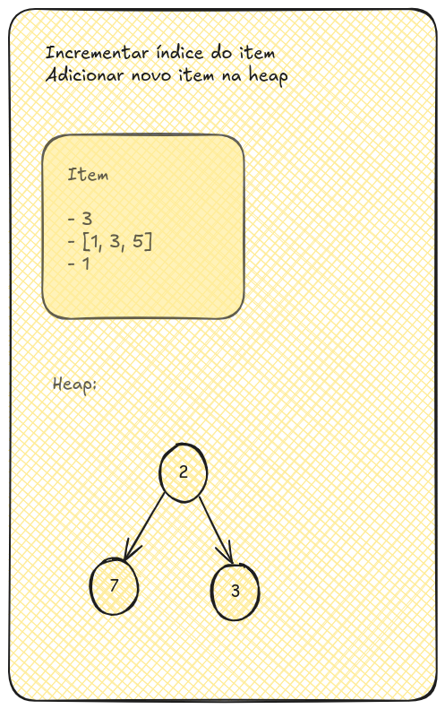

Repetimos o passo de remover o primeiro item da heap e adicionar na lista final: `[1,2]`. 

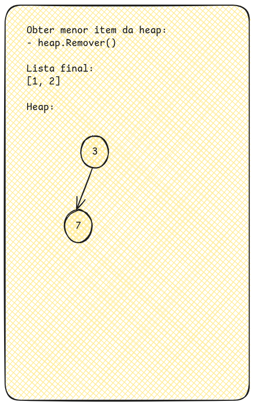

Devemos incrementar o item na respectiva lista. como o 2 foi removido e está na segunda lista [2,4,6], o item que vai para a heap é:
- valor: 4
- lista: [2,4,6]
- índice: 1

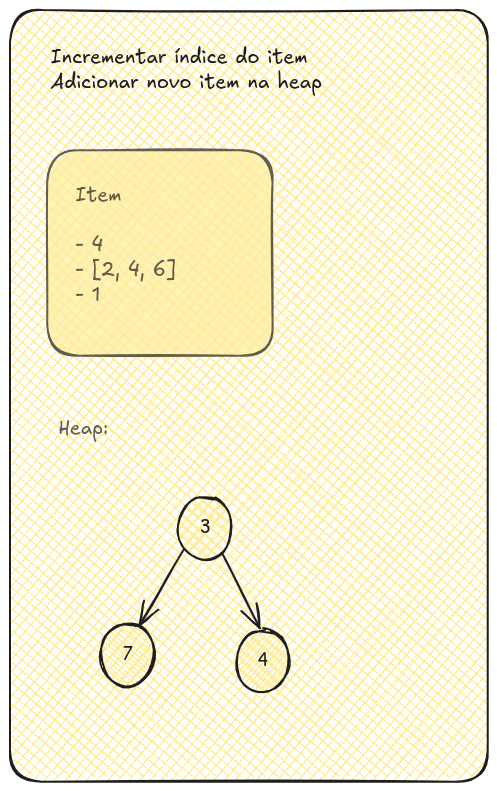

Repetimos o passo de remover o primeiro item da heap e adicionar na lista final: `[1,2,3]`. 

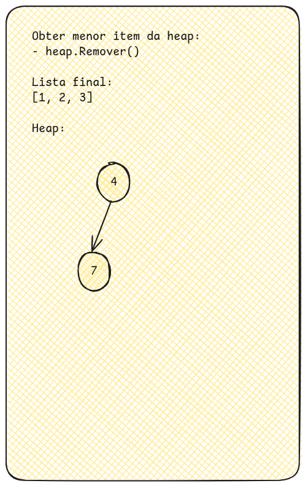

Devemos incrementar o item na respectiva lista. como o 3 foi removido e está na primeira lista [1,3,5], o item que vai para a heap é:
- valor: 5
- lista: [1,3,5]
- índice: 2

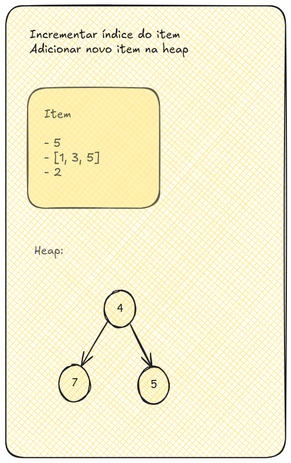

Repetimos o passo de remover o primeiro item da heap e adicionar na lista final: `[1,2,3,4]`. 

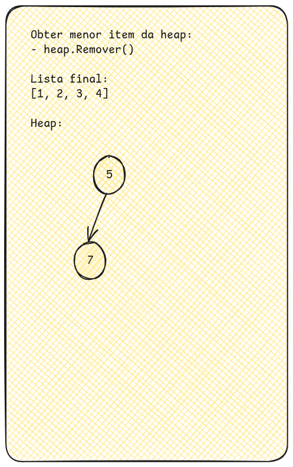

Devemos incrementar o item na respectiva lista. como o 4 foi removido e está na segunda lista [2,4,6], o item que vai para a heap é:
- valor: 6
- lista: [2,4,6]
- índice: 2

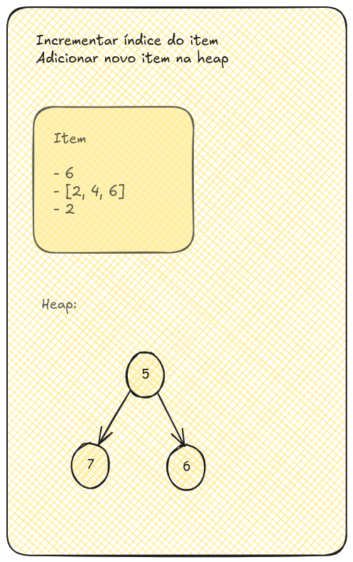

Repetimos o passo de remover o primeiro item da heap e adicionar na lista final: `[1,2,3,4,5]`. 

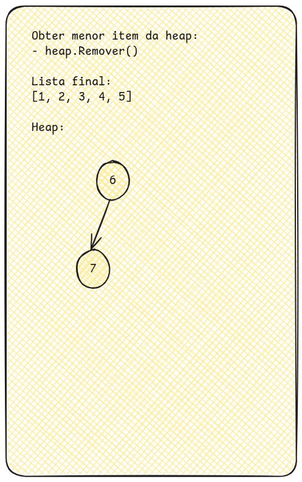

Devemos incrementar o item na respectiva lista. como o 5 foi removido e está na primeira lista [1,3,5], não temos mais novos valores.

Repetimos o passo de remover o primeiro item da heap e adicionar na lista final: `[1,2,3,4,5,6]`. 

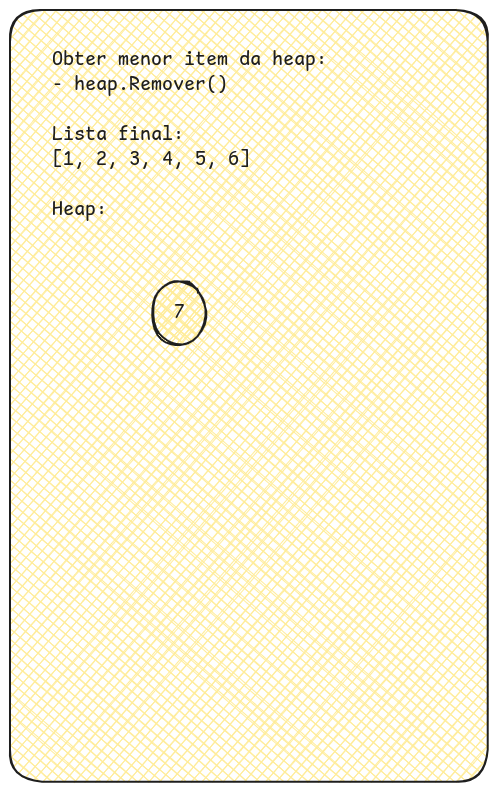

Devemos incrementar o item na respectiva lista. como o 6 foi removido e está na segunda lista [2,4,6], não temos mais novos valores.

Repetimos o passo de remover o primeiro item da heap e adicionar na lista final: `[1,2,3,4,5,6,7]`. 

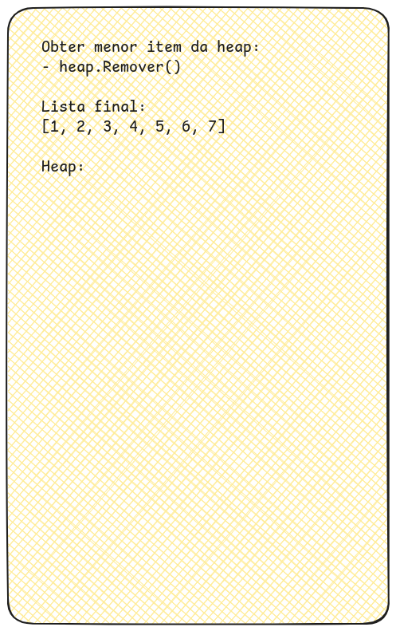

Devemos incrementar o item na respectiva lista. como o 7 foi removido e está na segunda lista [7,10], o item que vai para a heap é:
- valor: 10
- lista: [7,10]
- índice: 1

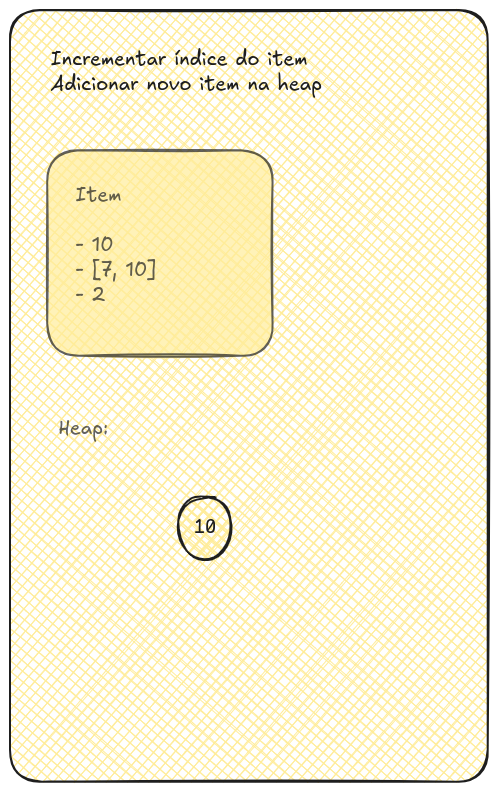

Repetimos o passo de remover o primeiro item da heap e adicionar na lista final: `[1,2,3,4,5,6,7,10]`. 

Como a heap está vazia e não existem novos itens nas listas, o resultado fica: `[1,2,3,4,5,6,7,10]`.

