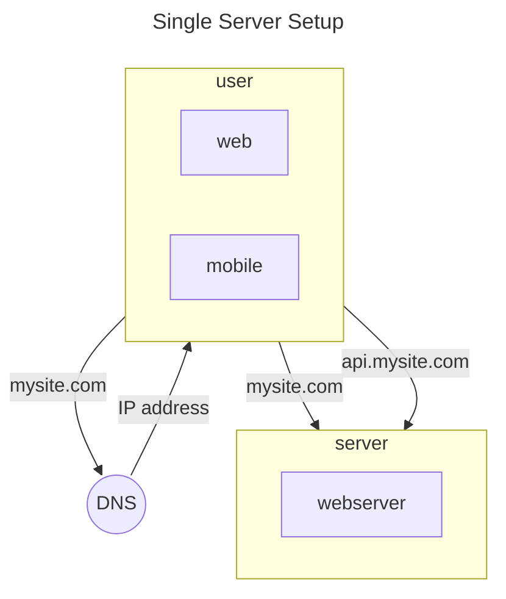
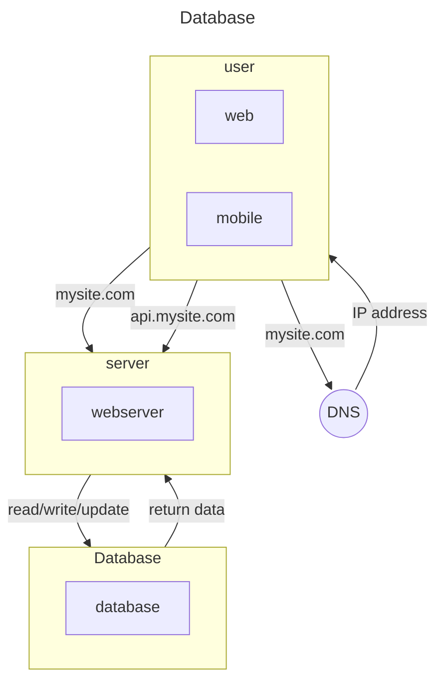

# System Design

## Índice
1. [Scale from Zero to Millions of Users](#scale-from-zero-to-millions-of-users)
    1. [Single Server Setup](#single-server-setup)

## Scale from Zero to Millions of Users

### Single Server Setup

Add database

#### Banco SQL x NoSQL

#### CAP
- Consistência:
    Todos os clientes veem os mesmos dados ao mesmo tempo. Indenpdendente do nó.
- Disponibilidade:
    Toda solicitação terá uma resposta mesmo que um ou mais nós estejam desativados
- Particionamento:
    Deve continuar a funcionar mesmo ocorra ou mais falhas de comunicação entre os nós do sistema

<!--

 -->